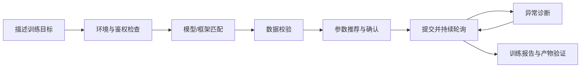

# CLI Trainer Skill — AI Studio 无代码大模型训练 Skill

> 一句话触发，全程引导，不需要写一行训练代码，在 AI Studio 云端完成大模型微调。

---

## 项目背景

大模型微调通常涉及模型与框架匹配、数据格式、算力配置、超参数、任务状态和产物交付。对第一次训练模型的用户而言，真正困难的不是“提交一个训练任务”，而是知道当前该选择什么、失败后如何恢复，以及训练完成后如何验证模型是否可用。

CLI Trainer 将这些分散步骤重构为 Agent 可执行的长任务流程：



### 设计原则

- **先检查再提交**：尽可能在消耗 GPU 前发现模型、数据和参数问题
- **关键决策由用户确认**：Agent 负责推荐和解释，不替用户静默提交高成本任务
- **过程可观测**：把平台状态、日志和 loss 变化翻译成可理解的进度反馈
- **以可用产物为终点**：任务成功不等于交付成功，继续验证模型仓库、合并导出和调用链路

---

## 这个 Skill 能做什么

帮你在百度 AI Studio 星河社区完成大模型 SFT 微调，全程无需 GPU、无需配环境、无需写训练代码。

支持：
- **文心 ERNIE 系列**（ERNIE-4.5-0.3B/21B-A3B 全系）：PaddleFormers 框架，Full 参数微调
- **开源模型**（Qwen2.5、Qwen3、DeepSeek-R1-Distill、MiniCPM、Baichuan2 等）：LlamaFactory 框架，支持 SFT、LoRA、DPO、KTO

---

## 环境要求

**使用前请确认以下环境已就绪：**

- **Python 3.8+**：运行脚本的基础环境。未安装时请先安装：
  - macOS：`brew install python3`
  - Windows/Linux：前往 https://www.python.org/downloads/ 下载安装
- **requests 包**：运行 `pip install requests` 安装（唯一的第三方依赖）
- **AI Studio Access Token**：在 https://aistudio.baidu.com/account/accessToken 获取；可通过环境变量、`--api-key`、`.env`，或 `aistudio config/login` 写入的 `~/.cache/aistudio/.auth/token` 提供
- **网络**：需能访问 `train.aistudio-app.com`

安装好 Python 后，可以运行以下命令一键自检（requests 缺失时会自动安装）：
```bash
python3 scripts/train.py --env-check
```

**可选：**
- web-access/CDP：自建数据集时默认使用，用你已登录的 Chrome 自动创建新版数据集仓库；如果缺失，Skill 会先帮你安装/启用 `web-access`，再按实际安装目录运行 `scripts/check-deps.sh`。安装后建议重启 Codex，让后续会话自动识别新 skill。
- Playwright MCP：配置后可在浏览器内直接操作训练看板；未配置时 `--open-tb` 会在任务 running 后调用系统默认浏览器打开

---

## 核心能力亮点

### 1. 白名单选型，不用猜模型名
Skill 会先列出 AI Studio 当前可训练的模型白名单，再让你选择模型，避免把不可训练的模型路径提交到平台。

### 2. 数据检查和上传校验
训练前会检查数据文件是否符合目标模型需要的格式；自建数据集可用 `aistudio-sdk` 的 `upload_folder` 上传到星河社区仓库，也可用 CLI 上传单个训练文件。上传后会继续校验仓库文件和本地文件是否一致，尽量把问题拦在提交训练前。

### 3. 超参推荐，减少踩坑
根据数据量自动推荐合适的超参数，两种框架参数完全隔离：
- ERNIE (PaddleFormers)：`max_seq_len`、`bf16`、`warmup_steps` 等
- 开源模型 (LlamaFactory)：`cutoff_len`、`fp16`、`warmup_ratio`、`lora_rank` 等

传错框架的参数会在本地直接拦截，不会浪费 GPU 时间。

### 4. 主动轮询，不让你干等
提交后持续轮询训练任务，并用通俗语言解释当前阶段含义：
- `waiting_data`：平台正在准备模型和数据集
- `pending`：任务已排队，等待 GPU 分配
- `running`：报告进度百分比、已用时、预计剩余时间，并解读 loss 趋势

### 5. 自动打开可视化看板
任务进入 `running` 且拿到 Tensorboard 地址后，自动打开可视化看板，方便观察训练曲线。

### 6. 训练完成汇报
训练结束后自动运行 `--train-summary`，输出：
- loss 起始值、最终值、下降幅度（e.g. "loss 下降 52%，训练收敛正常"）
- 收敛健康状态诊断
- ASCII loss 折线图
- 模型仓库地址；按平台当前支持的 API 或部署入口验证效果

### 7. 产物可用性验证
训练完成后不仅看任务是否成功，还会引导你通过模型仓库、API 调用或平台入口验证产物是否真的可用。LoRA 任务会额外确认是否完成合并导出。

### 8. 模型仓库默认公开
训练产物会自动上传到 AI Studio 模型仓库。Skill 默认按公开发布处理；如果平台生成后仍显示私密，会提醒你到模型库页面改为公开，并补充模型卡片、协议和可见性设置。

### 9. 效果测试建议
训练完成后可以根据训练数据生成测试问题建议，帮助你区分“训练集内记住了”“同类问题能泛化”和“基础能力是否受影响”。

---

## 内置数据集

| 数据集 | 适用框架 | 说明 |
|--------|---------|------|
| lmtyyz/lima | 开源模型 | 高质量对话，小体量，推荐入门 |
| lmtyyz/alpaca-gpt4-data-zh | 开源模型 | 中文通用指令，中等体量 |
| lmtyyz/Multilingual-Thinking | ERNIE | 多语言推理链，小体量 |
| lmtyyz/school-math-0.25M | 开源模型 | 数学能力增强 |

---

## 如何触发

在你使用的 AI 编程助手对话框中，说任何包含以下关键词的句子即可：

> 微调、训练模型、无代码训练、SFT、LoRA、fine-tune、AiStudio 训练、ERNIE 微调、模型训练、finetune

示例：
- "帮我微调一个 Qwen 模型，用来做客服问答"
- "我想用自己的数据 fine-tune ERNIE，怎么弄？"
- "帮我跑一遍无代码训练流程"

---

## 完整流程（Skill 会逐步引导你）

```
1. 环境自检   检查 Python、依赖、网络和 token 覆盖情况
2. 鉴权       确认 AI Studio Access Token（没有会引导你去获取）
3. 选模型     展示白名单，让你选，不用自己猜模型名
4. 验数据     检查训练数据是否适配目标模型
5. 准备数据集 可用内置数据集，也可上传自己的数据集
6. 推荐超参   根据数据量自动推荐参数，逐行解释，等你确认后才提交
7. 提交训练   一键提交到平台，拿到任务 ID
8. 持续轮询   持续打印训练任务阶段和进度，任务开始后打开 Tensorboard
9. 训练报告   训练完成后汇报 loss 趋势、健康状态和模型仓库
10. 效果测试  生成测试问题建议，引导你验证微调效果
```

---

## 常见注意事项

- **从官方基础模型开始训练**：平台白名单只允许官方基础模型作为起点，想迭代效果需合并数据集后重新训练。
- **自建数据集使用 AI Studio 数据集仓库**：本地数据需要先上传到新版 Git 仓库型数据集，并使用详情页里的完整 `repo_id`。
- **上传前确认账号命名空间**：`repo_id` 前缀是实际 `gitlogin`，不要用昵称、展示名或邮箱猜。
- **SDK 上传不要硬编码 token**：`aistudio-sdk` 上传时只从 `AISTUDIO_ACCESS_TOKEN` 环境变量读取 token；优先使用 `用户名/仓库名` 形式的 `repo_id`，不要用数字 `dataset_id`。
- **模型默认公开发布**：训练成功会生成模型仓库；如果平台生成后显示私密，需要在 AI Studio 模型库页面改为公开，并确认模型卡片和协议。
- **具体模型以白名单为准**：可训练模型、框架和模型级提示以 `python3 scripts/train.py --list-models` 输出为准。
